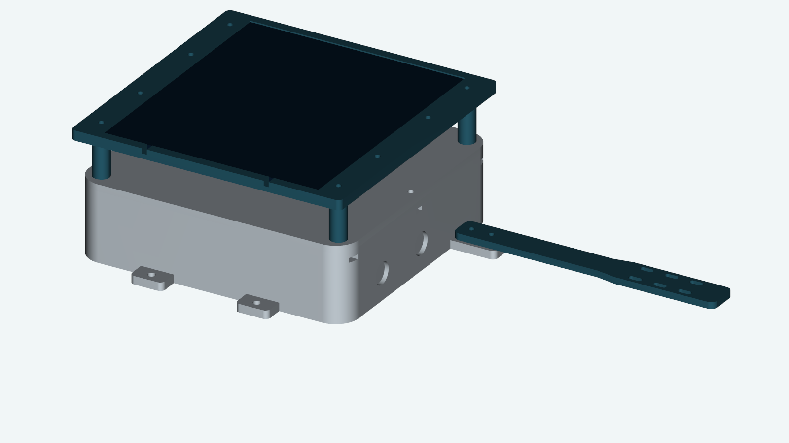
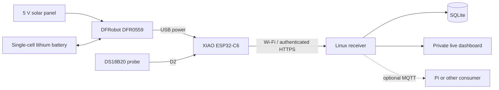

# Solar roof temperature sensor

A solar-powered **Seeed XIAO ESP32-C6** reads a waterproof DS18B20 probe, sends a reading over Wi-Fi, then sleeps. A separate Linux receiver stores readings and serves a live dashboard. This repository contains the wiring, firmware, receiver, perfboard layout and printable enclosure needed to reproduce the build.

The original unit is assembled and mounted. The current tray and probe arm have been physically fitted. Outdoor lifetime, sealing and battery endurance depend on the installation; the printed enclosure has no certified IP rating.

## How it works

The sensor can use an isolated device Wi-Fi network. Tailscale Funnel gives it an HTTPS route to the receiver without joining the tailnet. The receiver can run on a DGX, spare Linux computer or server; a Pi or pool controller can consume its data independently. The sensor does not depend on chlorination, flow-control software or a running Pi.

Default firmware sleeps for **300 seconds**, with at most 20 seconds awake per cycle. It verifies TLS and requires an acknowledgement after the receiver saves the event. Network failures lead to sleep and a fresh reading next wake; the node does not buffer missed readings. Retried events keep their original receipt time.

## Build it in this order

| Step | Guide | Completion check |
| --- | --- | --- |
| 1 | [Parts and tools](docs/parts.md) | Correct C6, power manager and measured component sizes |
| 2 | [Breadboard wiring](docs/wiring.md) and [USB probe firmware](docs/firmware.md#1-test-the-probe-over-usb) | A valid temperature changes when you warm the probe |
| 3 | [Receiver setup](monitor/README.md) and [wireless firmware](docs/firmware.md#2-build-the-wireless-firmware) | A new reading appears on the dashboard |
| 4 | [Battery and solar power](docs/wiring.md#battery-and-solar-power) | Readings continue on solar-manager USB power |
| 5 | [Perfboard layout](docs/perfboard/README.md) | Continuity and powered voltage checks pass |
| 6 | [Print and assemble](hardware/enclosure/README.md) | Parts fit, cables seal and readings continue after closing |
| 7 | Choose a mount for your location | Probe position, radio reception and attachment suit the site |

The [full schematic](docs/perfboard/full-schematic.svg) and perfboard views render on GitHub. Download the [complete Bambu X2D project](hardware/enclosure/bambu/solar-enclosure-X2D.3mf) or use the [STEP/STL models](hardware/enclosure/models) for another printer.

**Optional battery voltage:** the divider works while the C6 is powered, but is not automatically isolated when that power disappears. Leave its jumper open for the basic unattended build. Read the [battery-sense limits](docs/wiring.md#optional-battery-voltage) before adding it. Voltage is not a calibrated charge percentage.

## Find your way around

- [Troubleshooting](docs/troubleshooting.md): temperature, power and HTTPS faults.
- [Reproducing and changing the project](CONTRIBUTING.md): AI-agent starting prompt, source files and checks.
- [Optional mounting example](hardware/mount-example/README.md): a clamp mount for one roof structure. Another mount can use the enclosure's external ears.
- `firmware/`: USB test and sleeping Wi-Fi node; local credentials are ignored.
- `monitor/`: receiver, dashboard, transport checks and systemd installer.
- `hardware/enclosure/`: current CAD, models, settings and assembly instructions.

Start with the C6 build as documented. A different board, battery, adapter, perfboard hole pattern or panel can require wiring and CAD changes. Confirm differences before printing or soldering.
