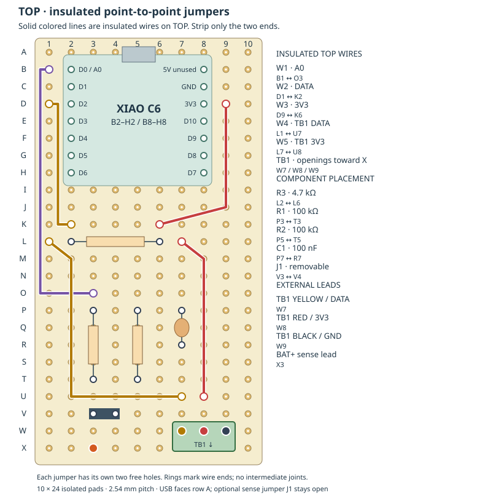
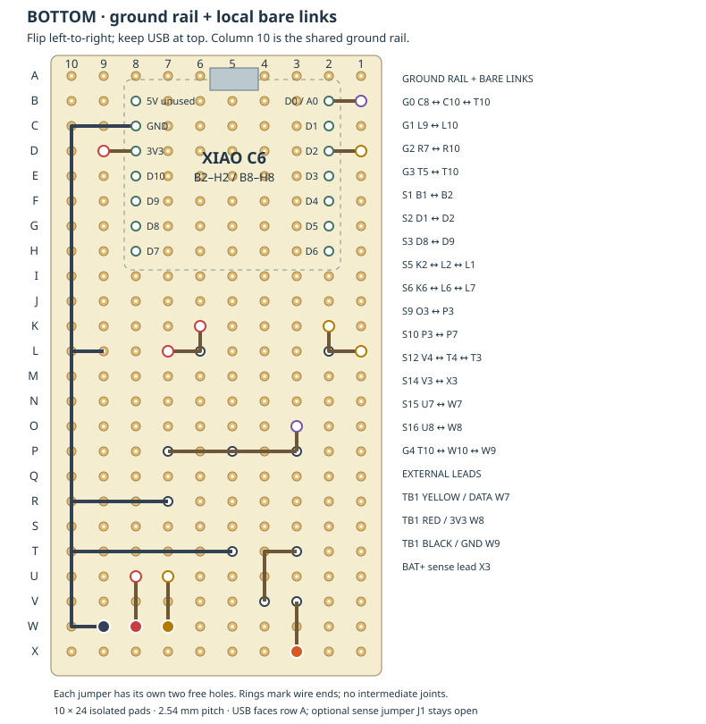

# Perfboard assembly

[Breadboard first](../wiring.md) · [Enclosure next](../../hardware/enclosure/README.md)

Use **30 × 70 mm isolated-pad board**, 10 columns across the short side and 24 rows along the long side. Numbers **1–10** run across; letters **A–X** run along. USB faces row A. These are hole coordinates, not GPIO numbers: hole **D2** happens to carry C6 signal **D2**, while A0 is at **B2**.

## Component side: insulated wires

All solid top runs are **insulated wires connecting their two ends**. A bend over another pad is not a solder joint. The C6 header rows occupy B2–H2 and B8–H8. Its B8/5V pad is unused.

| Part | Holes | Detail |
| --- | --- | --- |
| R3, 4.7 kΩ | L2–L6 | Probe DATA pull-up to 3V3; omit the breadboard adapter |
| R1, 100 kΩ | P3–T3 | Optional BAT+ sense resistor |
| R2, 100 kΩ | P5–T5 | Optional sense-to-ground resistor |
| C1, 100 nF | P7–R7 | Optional sense filter; nonpolar |
| J1, two-pin header | V3–V4 | Optional removable sense shunt; leave open initially |
| TB1, 3-position terminal | W7, W8, W9 | **DATA, 3V3, GND**, respectively; cable openings face row X |
| BAT+ sense lead | X3 | Optional, from manager BAT IN +; not the main battery power lead |

| Insulated wire | Endpoints | Signal |
| --- | --- | --- |
| W1 | B1 → O3 | A0 sense, optional |
| W2 | D1 → K2 | DATA, kept clear of D3–D6 headers |
| W3 | D9 → K6 | 3V3 |
| W4 | L1 → U7 | DATA to terminal block |
| W5 | L7 → U8 | 3V3 to terminal block |

Keep enough clearance around USB and terminal screws. The 2.54 mm block fits this layout; a wider-pitch block needs a new layout.

## Solder side: bare bridges and shared ground

This view is **mirrored left to right**, with USB still at the top. Columns now read 10–1. Do not turn the drawing upside down. Bare runs deliberately join intermediate pads on their listed paths; inspect them for accidental contact with adjacent pads.

| Run | Path |
| --- | --- |
| G0 | C8 → C10 → T10, shared ground rail |
| G1 | L9 → L10, spare ground landing |
| G2 | R7 → R10, capacitor ground |
| G3 | T5 → T10, resistor ground |
| G4 | T10 → W10 → W9, terminal ground |
| S1 | B1 → B2 |
| S2 | D1 → D2 |
| S3 | D8 → D9 |
| S5 | K2 → L2 → L1 |
| S6 | K6 → L6 → L7 |
| S9 | O3 → P3 |
| S10 | P3 → P7, including P5 |
| S12 | V4 → T4 → T3 |
| S14 | V3 → X3 |
| S15 | U7 → W7 |
| S16 | U8 → W8 |

For a temperature-only build omit R1, R2, C1, J1, the BAT+ lead, W1 and their dedicated sense/ground bridges. Keep the shared ground rail, probe pull-up and terminal wiring. If populating the full board, retain the [battery-sense power-off precautions](../wiring.md#optional-battery-voltage).

## Soldering order

1. With every power source disconnected, mark A1 and USB direction on the board. Dry-fit the C6/header footprint, terminal and mounting holes before soldering.
2. Fit resistors and capacitor first, then headers and terminal. Tack one pin on each header/block, check alignment, then finish. Keep leads low enough for the tray clearance.
3. Add the short bare bridges, then the ground rail, then the five insulated top wires. Solder wire ends; never strip an entire top run just to join two points.
4. Fit the C6 and inspect both sides under magnification. Avoid solder spikes below the board. Leave J1 open.
5. Feed the probe through its gland before terminating it. Clamp each stripped stranded wire securely; do not tin the portion under a screw terminal. Gently pull each lead to check retention. Glands provide cable strain relief.

## Checks before power

| Check | Expected result |
| --- | --- |
| C6 GND → W9 | Continuity |
| C6 3V3 → W8 | Continuity |
| C6 D2 → W7 | Continuity |
| DATA → 3V3 | About 4.7 kΩ, not a short |
| 3V3 → GND; DATA → GND | No persistent near-zero short |
| Unused C6 header pads → neighboring bare runs | No unintended bridge |
| A0 → P3/P5/P7, when fitted | Continuity |
| J1 removed: X3 → divider BAT input | Open across the jumper |
| Divider resistors, when fitted | About 100 kΩ each; circuit paths can affect in-place measurement |

With J1 open, power through USB and measure about **3.3 V at 3V3** relative to C6 GND. A battery voltage such as 3.8 V on 3V3 would be wrong. Confirm a valid new temperature remotely. Test optional sensing separately using the breadboard procedure. Disconnect power before mounting; repeat delivery checks after enclosing.

The drawings come from [render_layout.py](render_layout.py). Run `python3 docs/perfboard/validate_layout.py` to check connectivity and unintended header intersections after changing the layout. [layout.json](layout.json) is generated data, not a separate design to edit.
