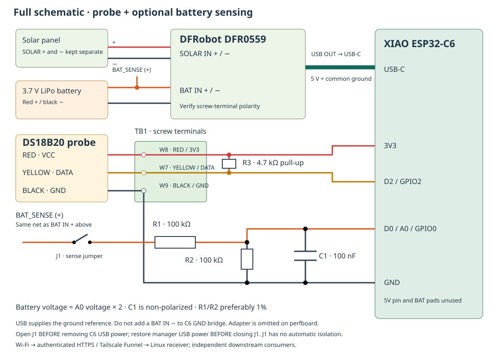

# Breadboard and power wiring

[Parts](parts.md) · [Firmware](firmware.md) · [Perfboard](perfboard/README.md)



The drawing includes optional battery sensing. Start with the probe circuit and **leave J1 open**. Pin references are for the **XIAO ESP32-C6**: `A0`, `D0` and `GPIO0` identify the same physical pin; `D2` is GPIO2.

## Probe on USB power

Disconnect power while wiring. Put the C6 across the breadboard center gap. Check for split breadboard power rails before using them.

| From | To | Purpose |
| --- | --- | --- |
| C6 **3V3** | Probe VCC/red | Regulated probe power |
| C6 **GND** | Probe GND/black | Signal return |
| C6 **D2** | Probe DATA/yellow | OneWire data |
| 4.7 kΩ resistor | Between DATA and 3V3 | Data pull-up; no polarity |

For an adapter, use its **VCC/GND/DATA labels**, then connect those three signals to the C6. The original adapter already has a resistor marked `472` (4.7 kΩ). With power removed, measure DATA to VCC: about 4.7 kΩ means it is present. Do not add another pull-up in parallel. Loose resistors supplied with an adapter do not prove its pull-up is missing.

Before USB power, inspect for shorts and check each connection end-to-end. Power-to-ground resistance can change as capacitors charge; investigate a persistent near-zero value. Connect computer USB and run the [probe test](firmware.md#1-test-the-probe-over-usb). Confirm one sensor, valid temperature and a rise when warmed in your hand.

## Battery and solar power

Test [wireless delivery](firmware.md#2-build-the-wireless-firmware) while still on computer USB, so readings remain visible when you move the cable.

| Connection | Destination |
| --- | --- |
| Battery positive | DFR0559 **BAT IN +** |
| Battery negative | DFR0559 **BAT IN −** |
| Panel positive | DFR0559 **SOLAR IN +** |
| Panel negative | DFR0559 **SOLAR IN −** |
| DFR0559 USB OUT | C6 USB-C via short cable |

1. Keep solar disconnected and J1 open. Measure battery polarity: **red meter lead on positive, black on negative must read positive voltage**. A connector can fit with reversed polarity; the original pack connector did.
2. Connect BAT IN securely. Use screw terminals if connector polarity is wrong; never cut both live battery wires together.
3. Disconnect computer USB, then connect C6 to manager USB OUT. Keep its USB output-enable jumper fitted. If necessary press **BOOT on the DFRobot**, not BOOT on the C6.
4. Check C6 5V relative to GND is about 5 V and 3V3 is about 3.3 V. Look for a **new receipt time** on the dashboard; an old saved temperature does not prove delivery.
5. Measure panel polarity, connect SOLAR IN, and check continued delivery and indicators against the manager manual.

The [DFR0559 specification](https://wiki.dfrobot.com/dfr0559/) gives a 4.5–6 V operating solar input for a nominal 5 V panel. Check the panel's open-circuit voltage as well as its advertised operating voltage.

The C6 **5V pin and underside battery pads remain unused**. Its USB-C has one power source at a time. Direct 5V-pin power requires a separate power-path design before connecting computer USB. USB also supplies common ground for probe and divider. Do not bridge BAT IN − directly to C6 GND, which can bypass the manager's battery protection path.

## Optional battery voltage

This **manual, supervised sense circuit** is retained from the original build. It measures voltage, not an accurate remaining percentage.

```text
BAT IN + ── J1 removable jumper ── R1 100k ──┬── C6 A0 / D0
                                           ├── R2 100k ── C6 GND
                                           └── C1 100nF ── C6 GND
```

J1 is two header pins bridged by a removable shunt. It disconnects the thin sense lead, not the main battery power lead. Use a secure BAT+ connection; a terminal must reliably grip every conductor placed in it.

**Power-off limitation:** USB output can stop while the battery stays connected. With J1 closed, the divider can then feed an unpowered C6 GPIO. Software cannot disconnect that path. For an unattended reproduction, leave J1 open or omit sensing until automatic isolation has been designed and verified. `ROOF_BATTERY_SENSE=0` suppresses readings but does **not** isolate a physically connected divider.

To test on a powered bench:

1. Wire R1, R2 and C1 without power; keep J1 open. C1 is nonpolar. Check values and that BAT+ has no direct path to A0.
2. Power the C6 from manager USB. Before attaching the junction to A0, temporarily energize the divider and measure relative to **C6 GND**: junction voltage should be half BAT+. For example, 3.8 V gives about 1.9 V. Remove J1 before changing wiring.
3. Attach the verified junction to A0. With C6 powered, close J1. A 4.2 V cell gives about 2.1 V at A0.
4. Use firmware with `ROOF_BATTERY_SENSE=1`; compare reported voltage with the meter. The original one-point check was 3.882 V reported versus 3.86 V measured, not a full-range calibration.
5. **Open J1 before unplugging C6, maintenance or changing USB sources.** Close it only after power and ground are established; leave it open unattended without isolation.

The divider draws about 21 µA at 4.2 V. Firmware settles the filter, averages 32 calibrated ADC samples before Wi-Fi and multiplies by two. An unconnected A0 can float, so sensing defaults off.

## Ready for perfboard

Confirm a changing probe reading, authenticated delivery and operation on manager USB with the computer disconnected. No fixed multi-day breadboard soak is required before soldering. Repeat those functional checks after the transfer.
