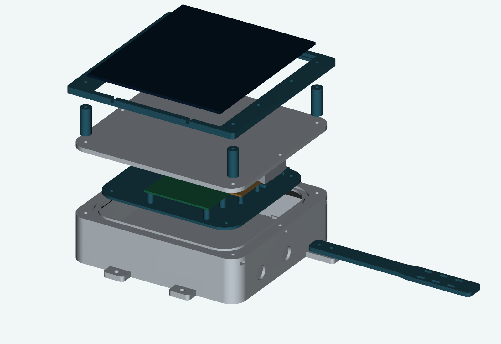
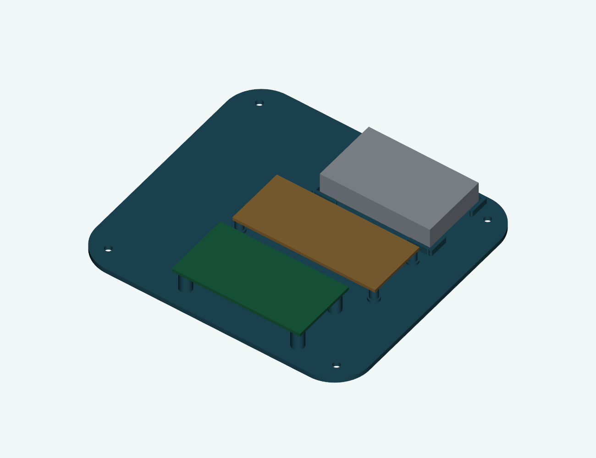
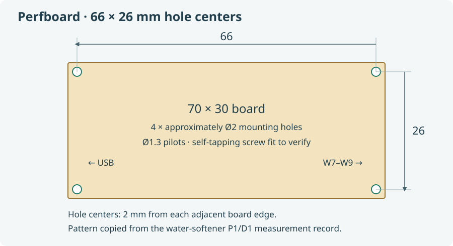
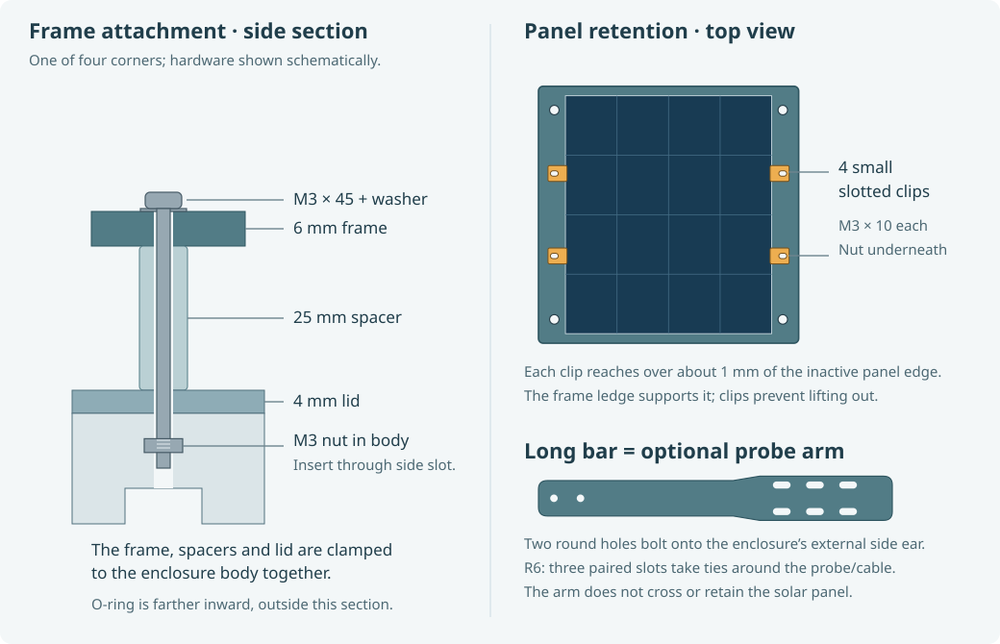
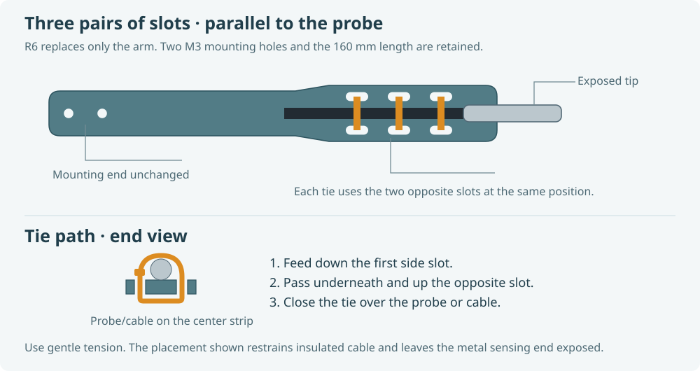

# Enclosure, printing and assembly

[Project overview](../../README.md) · [Parts](../../docs/parts.md) · [Optional mount](../mount-example/README.md)

This is the **current fitted set**: original body/lid/frame geometry, corrected four-corner perfboard tray and paired-slot probe arm. The full project contains these parts together. Old trays, edge clips and perpendicular-slot arms are no longer alternatives to choose between.

## Files to print

Download [solar-enclosure-X2D.3mf](bambu/solar-enclosure-X2D.3mf) with GitHub's **Download raw file** button and open it in Bambu Studio. It contains **13 objects on four plates** with saved X2D printer, process and filament settings. Check the selected printer, nozzle and plate before sending a print.

| Plate | Parts | Quantity |
| --- | --- | --- |
| 1 | [Base](models/base.stl) | 1 |
| 2 | [Lid](models/lid.stl), [25 mm panel spacers](models/panel_spacer.stl) | 1 + 4 |
| 3 | [Solar panel frame](models/panel_frame.stl) | 1 |
| 4 | [Tray](models/tray.stl), [panel clips](models/panel_clip.stl), [probe arm](models/probe_arm.stl) | 1 + 4 + 1 |

All parts have editable STEP companions in [models](models). `assembly-reference.step` includes non-printable component envelopes for clearance checks; do not slice the whole reference assembly.

The saved settings use **Bambu X2D, standard 0.4 mm nozzle, Textured PEI**, white PETG at **240 °C**, bed **80 °C first layer / 75 °C thereafter**, 0.20 mm layers, 6 walls, 6 top/bottom layers, 25% gyroid, no supports and a 6 mm outer brim. Outer walls are 45 mm/s and volumetric flow is capped at 8 mm³/s. These follow the original filament label; adjust for a different material or calibrated printer.

The project is sliced and reopened with Bambu Studio 2.8.2.61 CLI. Its [validation record](bambu/project-validation.json) records settings, mesh checks and estimates. Plate thumbnails are rendered from the actual CAD because offscreen native thumbnails were unavailable. GUI interaction, seal performance and hot-weather strength are not certified by those checks.

## Dimensions that must match your parts

| Item | Modeled fit |
| --- | --- |
| Body | 164 × 152 × 42 mm, excluding external mounting ears; 2.4 mm walls, 3 mm floor |
| Solar panel | 130 × 150 × 2.5 mm; 130.8 × 150.8 mm pocket, central wire clearance |
| Battery | Actual measured pack 54 × 33 × 10 mm |
| Perfboard | 70 × 30 mm; **66 × 26 mm hole centers**; 1.5 mm board, 10 mm components above and 1 mm solder below |
| DFR0559 | 63 × 33 mm; **55 × 25 mm hole centers**; 1.6 mm board, 9 mm components above and 1 mm below |
| Cable bend allowance | 45 mm beyond the manager board's USB end |
| Glands | Two PG7 holes, 13.2 mm diameter through 2.4 mm wall |
| O-ring | AS568-164 EPDM 70A, 158.42 mm ID × 2.62 mm cross section |
| Groove | 3.8 mm wide, 2 mm deep; rounded rectangle, 144 × 132 mm centerline, 22 mm corner radius |
| External mounting ears | Four 4.5 mm holes on 64 × 164 mm centers |

Different generic perfboards often have different mounting holes even if both are sold as “3 × 7 cm.” Measure centers before printing. The current perfboard posts replace the earlier incorrect mount; the DFRobot and battery locations remain fitted.

## Fasteners

Lengths are measured **under the head**, including a pointed self-tapping screw's tip. Use small pan or button heads where they clear the components. Drive printed-plastic screws by hand. Self-tapping means they cut/form threads in the printed pilot; **self-drilling screws are not intended**.

| Quantity | Fastener | Joint | Type |
| --- | --- | --- | --- |
| 4 | **M1.7 × 6 mm** | C6 **perfboard** to tray posts | **Self-tapping for plastic**, no washer in the calculated stack |
| 4 | **M3 × 5 mm** | DFRobot to raised tray posts | **Self-tapping for plastic**, no washer in the calculated stack |
| 4 | **M3 × 6 mm** | Tray to body posts | **Self-tapping for plastic**, no washer in the calculated stack |
| 4 | **M3 × 45 mm** | Frame → spacer → lid → body corner nut | **Machine screw** + flat washer |
| 2 | **M3 × 12 mm** | Two middle side lid holes → body nuts | **Machine screw** + flat washer |
| 4 | **M3 × 10 mm** | Four panel retaining clips → frame nuts | **Machine screw** + flat washer |
| 2, optional | **M3 × 10 mm** | Probe arm → body bracket nuts | **Machine screw** + flat washer |
| 12, or 10 without arm | Ordinary M3 hex nuts | Six body closure pockets, four clip pockets, two arm pockets | Not nylon locknuts; pockets assume about 5.5 mm across flats / 2.4 mm thickness |
| 12, or 10 without arm | M3 flat washers, about 0.5 mm thick | Machine-screw joints above | Do not add to board/tray stacks without recalculating |

The original builder recalled **M1.7 self-tapping for the C6/perfboard** and **M3 self-tapping for DFRobot and tray**. The lengths above are derived from the CAD, not a guess at the installed screws:

| Joint | Material under screw head | Blind pilot depth | Screw insertion including point | Remaining tip clearance |
| --- | --- | --- | --- | --- |
| Perfboard, 6 mm screw | 1.5 mm board | 5.3 mm, Ø1.3 mm | 4.5 mm | **0.8 mm** |
| DFRobot, 5 mm screw | 1.6 mm board | 5.0 mm, Ø2.6 mm | 3.4 mm | **1.6 mm** |
| Tray, 6 mm screw | 2.4 mm tray | 4.0 mm, Ø2.6 mm | 3.6 mm | **0.4 mm** |

**The tray clearance is tight.** Check actual screw length, print thickness and pilot depth before tightening. A screw must clamp the part before its tip bottoms out. Self-tapping thread profiles vary; nominal diameter alone does not prove pilot compatibility. Check one post by hand, stop if the post cracks or the screw bottoms, and avoid an oversized head touching circuitry. The C6 itself is soldered to the perfboard; these four small screws secure the perfboard, not the C6 module.

## Assembly sequence

1. Remove brims and strings. Dry-fit gland nuts, ordinary M3 nuts and boards. Inspect screw pilots without enlarging them indiscriminately. Keep batteries away from tools and loose screws.
2. Install two glands with their supplied wall seals. Use **one round cable per gland**: probe and panel separately. Two cables under one ordinary round seal leave a potential leak path. Pass cables through before termination and make external drip loops.
3. Fasten DFRobot and perfboard to the tray using their self-tapping screws. Keep solder protrusions within the modeled 1 mm underside clearance. Strap the battery softly in its cradle; do not puncture or compress it.
4. Fit the tray with four M3 × 6 self-tapping screws. Route the short USB cable in its bend space; secure wiring away from lid, O-ring and fasteners. Complete the [power and reading checks](../../docs/perfboard/README.md#checks-before-power).
5. Fit the panel in the frame, rear toward the enclosure. Slide the **four panel clips** over its inactive edge and fasten with M3 × 10 machine screws and nuts. The frame ledge supports the panel; the clips keep it from lifting. They are not clamps for crushing the panel. Allow its rear wires to bend without pinching.
6. Fit the probe arm, if used, with two M3 × 10 machine screws and nuts. Pass ties through the paired longitudinal slots, around the probe and back through the matching slot. Keep the sensing end exposed and away from direct contact with the warm enclosure.
7. Lay the O-ring evenly in the clean lid groove. Install the lid, four 25 mm spacers and panel frame. The four **M3 × 45** screws pass through frame and spacers, through the lid and into ordinary nuts captured in the body. The two **M3 × 12** screws close the remaining middle side holes. Tighten evenly; stop when seated rather than distorting the lid.
8. Confirm a new remote reading after closing. Check seals with the electronics and battery removed before relying on the case outdoors; dry completely afterward. Monitor internal temperature against the battery maker's charge-temperature limit, especially in sun. A white case and panel shade do not guarantee safe battery temperature.

Probe placement depends on what you want to measure. This exposed probe is a solar reference, not a shielded meteorological air-temperature sensor. Keep its sensing end outside enclosure/panel shadow and avoid touching the case or mounting hardware. Compare positions at your site; there is no universal minimum cable distance. A different mount can attach to the external ears without opening the sealed volume.

## Rebuild the design

See [development commands](../../CONTRIBUTING.md#cad-and-print-project). `build_enclosure.py` exports current solids, meshes and clearance/fastener checks. Edit the relevant geometry functions for substitutions, regenerate, inspect fit and regenerate the print project together. The exported `parameters.json` describes dimensions; editing it alone does not change CAD.
