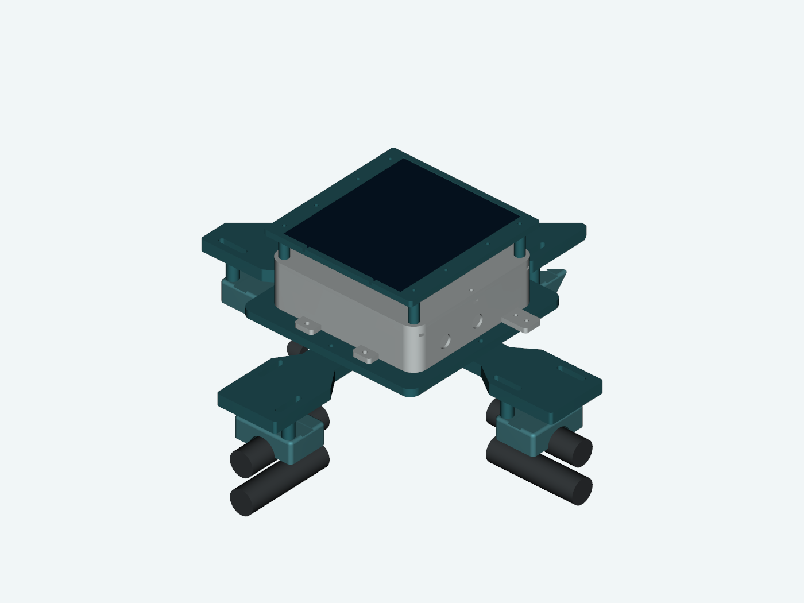
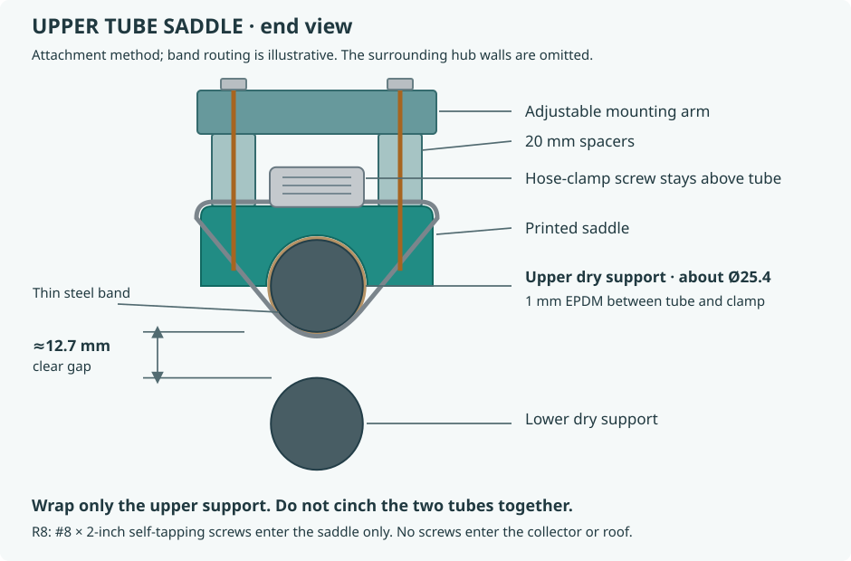
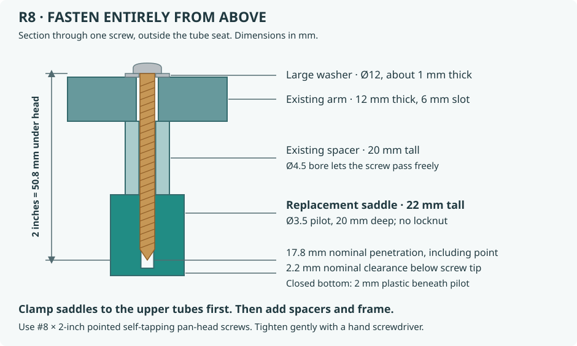

# Optional clamp-mount example

[Enclosure](../enclosure/README.md) · [Project overview](../../README.md)

This is one installed solution for a particular existing roof collector structure. It attaches to dry rigid support tubes using lined saddles and worm-drive clamps, without changing the assembled enclosure. Treat it as a worked example for adapting the enclosure's external ears, not a universal shingle attachment.

The original measurements were approximately 25.4 mm tube diameter, 12.7 mm clear vertical gap between tubes, 73 mm square openings and 305 mm between opposite opening centers. Slots allow approximately 281–329 mm opposite spacing. The carrier accepts the enclosure's four holes on **64 × 164 mm centers**. Measure your structure and assess its condition/load capacity before reusing this design.

## Parts and fasteners

| Part | Quantity | Notes |
| --- | --- | --- |
| [Carrier](models/carrier.stl) | 1 | 190 mm square frame |
| [Arm](models/arm.stl) | 4 | 12 mm thick, slotted saddle connections |
| [Saddle](models/saddle.stl) | 4 | Current self-tapping version; 3.5 mm pilots, 20 mm blind depth |
| [20 mm spacer](models/spacer-20.stl) | 8 | 4.5 mm bore, 12 mm outside diameter |
| M4 × 20 mm machine screw | 4 | Enclosure ears to carrier; M4 washers and nylon locknuts |
| M4 × 25 mm machine screw | 8 | Arms to carrier; M4 washers and nylon locknuts |
| **#8 × 2 inch self-tapping screw** | 8 | Stainless pan head; fits existing spacers and arm slots |
| Large washers, approximately 12 mm OD, 1 mm thick | 8 | Under #8 screw heads, covering 6 mm slots |
| Stainless worm-drive clamps, 40–60 mm range, 9 mm band | 4 | One around each upper tube and saddle; head must fit the 14 mm channel |
| 1 mm EPDM lining | 4 strips | Between saddle/clamp and tube |

The selected screw example is [Everbilt #8 × 2 inch stainless pan-head self-tapping, model 807872](https://www.homedepot.com/p/204283146). A 50.8 mm screw through a 1 mm washer, 12 mm arm and 20 mm spacer enters the saddle by **17.8 mm**, leaving **2.2 mm** before the blind pilot floor. This includes the pointed tip, not all full-depth threads. Check actual screw and washer dimensions.

Use [replacement-saddles-X2D.3mf](replacement-saddles-X2D.3mf) for **four saddles only**, configured for the same white PETG/X2D setup as the enclosure. Its [mesh validation](project-validation.json) confirms the current saddle geometry. It does not contain carrier, arms or spacers; their current STEP/STL files are in [models](models). The supplied saddle STL is already rotated onto its axial end for printing. Do not print the assembly-reference meshes as extra parts.

## Installation order

1. Line and place each saddle over its **upper dry support tube**. Thread one worm clamp under that tube and through the saddle's crown channel. Do not wrap both tubes together. Tighten only enough to retain the saddle without damaging aged plastic.
2. Attach the four arms to the carrier, then the assembled enclosure to the carrier using the M4 machine screws and locknuts.
3. Set the assembly on the eight spacers. Insert #8 screws from above, through washers, arm slots and spacers into the saddle pilots. The spacers must be free clearance around the screws. Hand-tighten evenly; no inaccessible locknut is required below a saddle.
4. Check that neither screws nor clamps touch the lower tubes or roof, cables have slack and drip loops, the panel/probe have the intended exposure, and new readings still arrive.

`build_mount.py` reproduces the current geometry using the enclosure's CAD helpers. The original unit is mounted, but there is no measured wind rating, hot-weather creep life or pull-out rating. Do not attach blindly to shingles, plumbing or an unknown roof component; choose and verify an attachment appropriate to the actual site.
